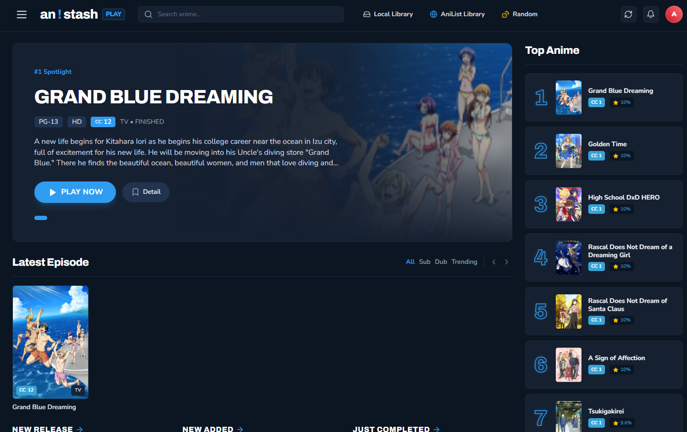
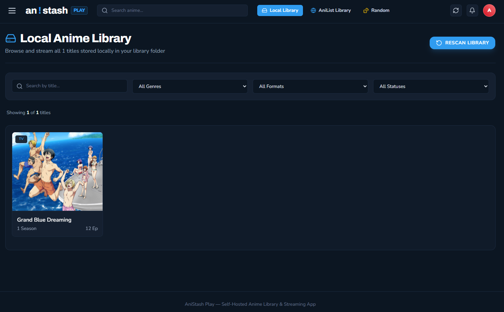
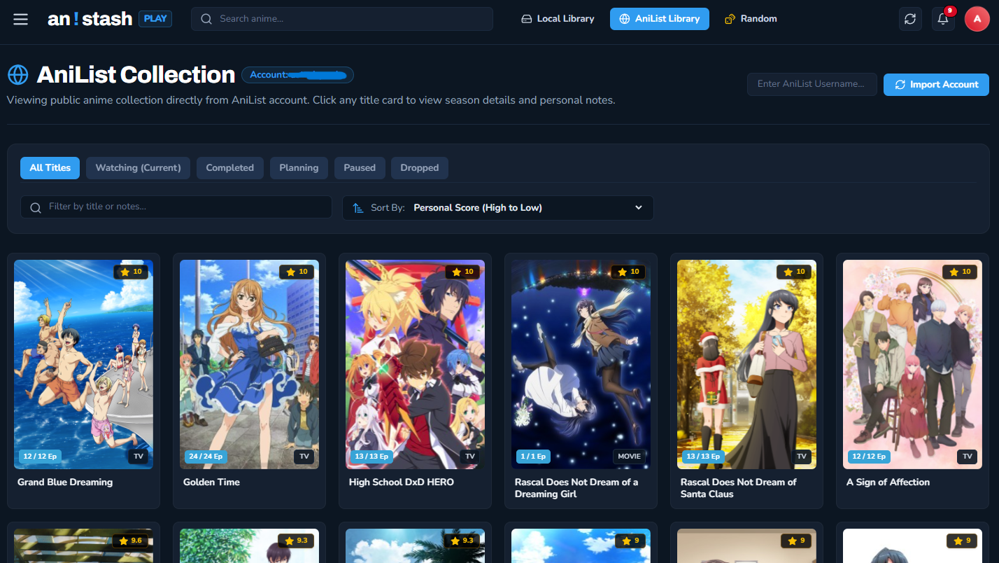
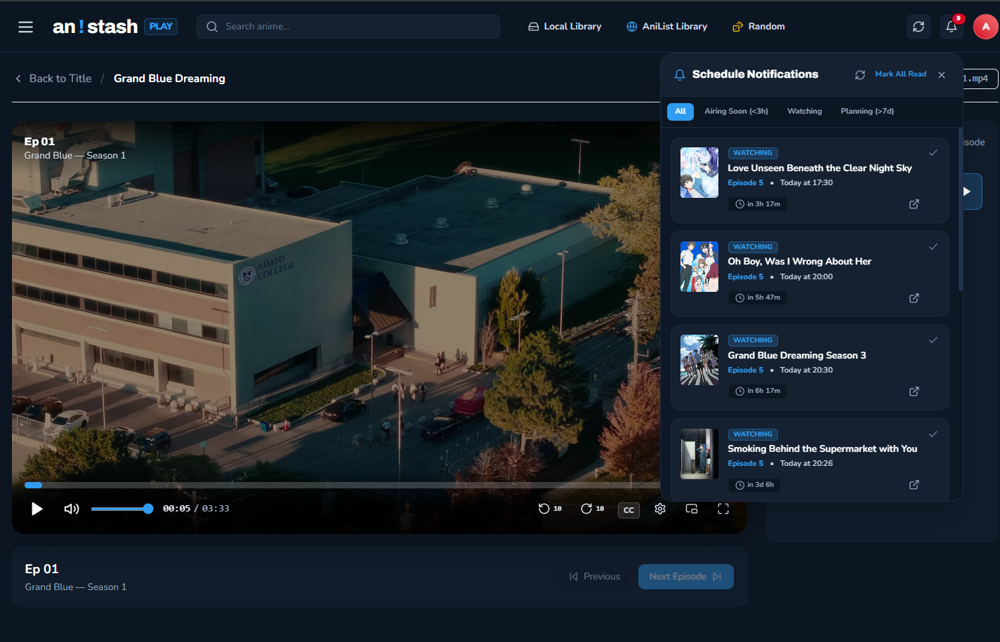

# AniStash Play - Your Local Anime Library and Player

A self-hosted, privacy-first anime media server that runs entirely on your own machine.
Stream your local anime collection through a polished web interface, sync with your AniList account, import external subtitles, and track your watch progress. No cloud, no accounts required to get started.

> Inspired UI From- aniktotv
---

## Screenshots

<table>
  <tr>
    <td width="50%">
      
      <p align="center"><b>Homepage - Continue Watching & Airing Schedule</b></p>
    </td>
    <td width="50%">
      
      <p align="center"><b>Local Library - Browse Your Collection</b></p>
    </td>
  </tr>
  <tr>
    <td width="50%">
      
      <p align="center"><b>AniList Library - Sync Your Watching List</b></p>
    </td>
    <td width="50%">
      
      <p align="center"><b>Notifications & Player</b></p>
    </td>
  </tr>
</table>

---

## Features

- **Local Streaming** - Stream `.mp4`, `.mkv`, `.webm`, `.avi`, `.mov` files directly from your hard drive via HTTP Range requests
- **AniList Integration** - Automatically fetches metadata, posters, genres and synopsis from AniList for every anime in your library
- **Watch Progress Tracking** - Saves your position per episode; resume exactly where you left off
- **Subtitle Import** - Import `.srt`, `.vtt`, `.ass` or `.ssa` subtitle files inside the player; the file is renamed to match the episode and saved permanently to disk for future sessions
- **Metadata Matcher** - For any unrecognized title, a search popup lets you select the correct AniList entry and download its poster and banner
- **AniList Library Sync** - Browse your full AniList library (Watching, Completed, Planning, Paused, Dropped) alongside your local files
- **Top Anime Sidebar** - Displays your highest-scored anime from AniList
- **Airing Schedule** - Shows upcoming episodes for anime you are currently watching on AniList
- **Custom Video Player** - Built-in player with seek preview thumbnails, playback speed control, Picture-in-Picture, and double-tap fullscreen toggle
- **Local Status Categories** - Organize local files into `watching`, `planned`, and `finished` folders; the UI reflects these statuses automatically
- **Library Rescan** - Refresh your library at any time with the Rescan button without restarting the server

---

## Getting Started

### 1. Prerequisites

You will need the following installed on your machine:

- [Node.js](https://nodejs.org/) v18 or later
- npm (included with Node.js)

### 2. Quick Install

**Windows:**
```bash
install.bat
```

**macOS/Linux:**
```bash
chmod +x install.sh
./install.sh
```

This will automatically:
- Install all dependencies
- Build the client application
- Prepare the server

### 3. Manual Installation (Alternative)

If you prefer to install manually:

```bash
# Install server dependencies
cd site/server
npm install
cd ../..

# Install client dependencies
cd site/client
npm install

# Build the client
npm run build
cd ../..
```

### 4. Configure the Application

Open `config.json` in the project root. This is the only file you need to edit:

```json
{
  "anilistUsername": "YourAniListUsername",
  "port": 4321,
  "libraryPath": "./anime"
}
```

| Field | Description |
|---|---|
| `anilistUsername` | Your AniList username. Used to fetch your library, top anime and airing schedule. Leave as `YourAniListUsername` to disable AniList features. |
| `port` | The port the local server listens on. Default is `4321`. |
| `libraryPath` | Path to your anime folder. Can be relative (`./anime`) or absolute (`D:/Media/Anime`). |

> **Note:** Your AniList username is never shared or sent anywhere except the official AniList GraphQL API. No login or OAuth is required.

### 5. Organize Your Anime Library

AniStash Play reads your anime folder and builds a library index from the folder structure.

**Recommended structure with status categories:**

```
anime/
  watching/
    Grand Blue/
      Season 1/
        Episode 01.mp4
        Episode 02.mp4
      Season 2/
        Episode 01.mp4
  planned/
    Chainsaw Man/
      Season 1/
        Episode 01.mkv
  finished/
    Steins Gate/
      Season 1/
        Episode 01.mp4
        Episode 02.mp4
```

**Flat structure (all treated as "watching"):**

```
anime/
  Grand Blue/
    Episode 01.mp4
    Episode 02.mp4
```

Rules:
- The top-level status folders must be named exactly `watching`, `planned`, or `finished`.
- Each anime lives in its own folder directly inside a status folder. The folder name is used to search AniList for metadata.
- Season subfolders are optional. Name them anything you like (e.g. `Season 1`, `OVA`, `Movie`). If there are no season subfolders, video files placed directly in the anime folder are grouped as a single season automatically.
- Supported video formats: `.mp4`, `.mkv`, `.webm`, `.avi`, `.mov`

### 6. Episode Naming

Episode files are sorted using natural order so numbering is correct regardless of zero-padding.

Recommended naming pattern:

```
Episode 01.mp4
Episode 02.mp4
Episode 10.mp4
Episode 11.mp4
```

You can use any consistent naming scheme. The filename without the extension is displayed as the episode label in the player.

### 7. Season Naming

Season folders can be named freely. Examples that work well:

```
Season 1/
Season 2/
OVA/
Specials/
Movie/
Part 1/
```

### 8. Start the Server

```bash
node site/server/index.js
```

Then open your browser and go to:

```
http://localhost:4321
```

The server scans your anime folder on startup and creates `meta.json` files for each title with minimal placeholder data. You can then use the **Metadata Matcher** in the UI to link each anime to its correct AniList entry and download posters/banners.

> **Note:** The server does NOT automatically fetch from AniList during the initial scan. This gives you full control over metadata matching and prevents API rate limits. Use the manual metadata matcher for each anime to get full details, posters, and banners.

---

## Subtitles

### Subtitles Embedded in Video

If your `.mkv` file has embedded subtitle tracks, they appear automatically in the CC menu inside the player. Click the CC button to choose a track.

### Importing an External Subtitle File

1. Open any episode in the player.
2. Click the **CC** button in the player controls.
3. Click **Import Subtitle File**.
4. Select a `.srt`, `.vtt`, `.ass`, or `.ssa` file from your computer.
5. The subtitle is immediately applied to the video.
6. The file is automatically renamed to match the episode filename and saved into the same folder as the episode on disk. For example, if the episode is `Episode 01.mp4`, the subtitle is saved as `Episode 01.srt` inside the season folder.
7. On the next playback session, the subtitle file is listed under **Saved on Disk** in the CC menu.

> **Tip:** `.srt` files are automatically converted to WebVTT format in-browser for playback. The original `.srt` file is what gets saved to disk.

---

## Metadata Matching

When a new anime folder is added, the server creates a minimal `meta.json` file with placeholder data (no AniList information). The title appears as the folder name with no poster or metadata.

To link an anime to AniList and get full metadata:

1. Click on the anime card in the local library.
2. A search popup appears automatically for unmatched titles.
3. Type the correct anime name in the search bar.
4. Select the correct anime from the results.
5. The server downloads the poster and banner, updates `meta.json` with full AniList details, and the anime card will display properly.

**Important**: The `meta.json` file is saved inside each anime folder. When you delete an anime folder:
- The metadata is automatically deleted with it
- The anime disappears from your library
- Progress data is automatically cleaned from the database

To re-trigger the matching popup for an already-matched title, delete the `meta.json` file inside the anime folder and rescan the library.

---

## Library Rescan

If you add or remove anime from your folder while the server is running, click the **Rescan Library** button inside the local library tab. The server re-indexes all folders and updates the in-memory cache without requiring a restart.

---

## Install as App (PWA)

AniStash Play can be installed as a Progressive Web App for a native-like experience with a custom icon and theme.

**On Desktop (Chrome / Edge):**
- Open `http://localhost:4321` in your browser.
- Click the install icon in the address bar.
- Select Install.

**On Mobile:**
- Open `http://localhost:4321` in Chrome (Android) or Safari (iOS).
- Tap Share, then Add to Home Screen.

The app uses a custom blue exclamation mark (!) icon on a dark background, matching the AniStash Play brand.

---

## Security and Privacy

- **Local only** - The server listens on `localhost` by default and is not exposed to the internet unless you explicitly forward the port.
- **Path traversal protection** - All file access is validated against the library index. File paths are never constructed directly from URL parameters. The server looks up the title slug in memory and resolves the real path from there.
- **No telemetry** - No usage data is collected or transmitted. The only external requests are to the AniList GraphQL API for metadata.
- **No authentication required** - This is a single-user local application. If you want to expose it on a local network, use a reverse proxy with authentication in front of it.
- **Security headers** - All responses include `X-Content-Type-Options: nosniff`, `X-Frame-Options: SAMEORIGIN`, and `X-XSS-Protection` headers.
- **Subtitle validation** - Only `.srt`, `.vtt`, `.ass` and `.ssa` extensions are accepted for subtitle upload. File size is capped at 20 MB.

---

## Common Issues

**Anime shows as "Unknown" or has no poster?**
- This is expected behavior. The server creates minimal metadata on the first scan.
- Click the anime card in the library to open the metadata matcher and select the correct AniList entry.
- This gives you full control and prevents API rate limits during bulk imports.

**Video will not play or shows a 404 error?**
- Make sure your video files are inside a season subfolder or directly in the anime folder.
- Check that the file extension is one of: `.mp4`, `.mkv`, `.webm`, `.avi`, `.mov`.
- Click Rescan Library to refresh the index.

**Subtitles not appearing after import?**
- After importing, click the filename shown in the CC menu to activate the track.
- Some `.ass` files with complex styling may not render correctly in the browser's native subtitle renderer.

**AniList features not loading?**
- Ensure `anilistUsername` in `config.json` is set to your actual AniList username (case-sensitive).
- AniList data is cached for 6 hours. To force a refresh, restart the server.

**Port already in use?**
- Change the `port` value in `config.json` to any available port (e.g. `4322`) and restart.

**Deleted anime still showing in "Continue Watching"?**
- The app automatically cleans deleted anime from the database on the next request. Simply refresh the page and the entries will disappear.
- Progress data is automatically removed when the corresponding anime folder no longer exists on disk.

---

## For Developers

### Tech Stack

- **Frontend:** React 18, TypeScript, Vite, Tailwind CSS
- **Backend:** Node.js, Express.js
- **Database:** SQLite via better-sqlite3 (stores watch progress and AniList cache)
- **External API:** AniList GraphQL API (public, no API key required)

### Project Structure

```
AniStash-Play/
  anime/                      Your anime library (watching/, planned/, finished/)
    .anistash/               Database folder (auto-created, git-ignored)
      progress.db            Watch progress and AniList cache
  config.json                 Server configuration (port, libraryPath, anilistUsername)
  config.example.json         Configuration template
  install.bat                 Windows installer script
  install.sh                  macOS/Linux installer script
  site/
    server/
      index.js                Server entry point
      db/
        init.js               SQLite schema and connection
      routes/
        library.js            Library listing, detail, metadata matching, rescan
        stream.js             Video streaming (Range requests) and subtitle upload/list
        image.js              Poster/banner image serving
        progress.js           Watch progress read/write
        anilist.js            AniList proxy routes (library, top anime, schedule, config)
      services/
        scanner.js            Anime folder scanner and in-memory index
        anilistClient.js      AniList GraphQL queries and cache helpers
    client/
      src/
        components/
          CustomVideoPlayer.tsx   Custom HTML5 video player with subtitle import
          Navbar.tsx              Top navigation bar
          Layout.tsx              App shell
          MetadataMatcherModal.tsx AniList title search and match popup
          TopAnimeSidebar.tsx     Top-scored anime sidebar widget
        pages/
          Home.tsx            Dashboard (continue watching, schedule, top anime)
          Library.tsx         Local library browser
          AniListLibrary.tsx  AniList library browser
          AnimeDetail.tsx     Anime detail page
          Player.tsx          Episode player page
        lib/
          api.ts              Typed API client
```

### Development Setup

```bash
# Install all dependencies
npm install

# Start the backend server (port 4321)
node site/server/index.js

# In a second terminal, start the Vite dev server (port 5173)
npm --prefix site/client run dev
```

The Vite dev server proxies all `/api/*` requests to `localhost:4321`.

### Build for Production

```bash
# Build the React client
npm --prefix site/client run build

# Start the production server (serves built client + API)
node site/server/index.js
```

### Database

SQLite is created automatically at `anime/.anistash/progress.db` on first startup (inside your anime library folder). It stores watch progress per episode and cached AniList responses. No manual setup is required.

**Important:** The database is stored in your anime folder so that:
- Your watch progress and AniList cache are preserved even if you delete the AniStash Play installation
- When an anime folder is deleted, its progress entries are automatically cleaned from the database
- You can safely commit the AniStash Play codebase to Git without including your personal data

The `anime/.anistash/` folder is ignored by Git.

---

**Built with ❤️ for anime fans who prefer to keep their collection local**

[Portfolio](https://astralquarks.pages.dev) • [GitHub](https://github.com/editinghero) • [Report an Issue](https://github.com/editinghero/anistash-play/issues)
